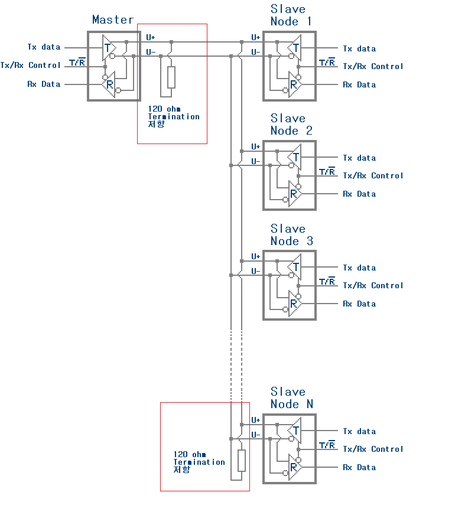

# RS485 consideration

### 1. multi slave is possible by 3 lines(D+, D-, GND)?   
Yes, a multi-slave configuration is possible using just three lines (D+, D-, and GND) in an RS-485 network. This is actually a common setup in industrial and commercial applications where multiple devices (slaves) are controlled or monitored by a single master   

### 2. how to address each slave?   
Each slave device on the RS-485 bus must have a unique address. When the master sends a message, it includes the address of the intended recipient (slave). Only the slave with the matching address will respond.

### 3. what is termination consideration for master - multi slave ?   
Proper termination prevents signal reflections, which can cause data corruption. 

1. Why Termination is Necessary:   
Signal Reflections: RS-485 networks use long cables, which can cause reflections of the electrical signals at the ends of the bus. These reflections can interfere with the original signals, leading to communication errors.
Impedance Matching: Termination resistors match the impedance of the cable, minimizing reflections and ensuring that the signal is clean and reliable.
2. Where to Place Termination Resistors:   
Two Ends of the Bus: In an RS-485 network, termination resistors should be placed at both ends of the bus.
First Termination: At the master device (if it is at one end of the network).
Second Termination: At the last slave device on the bus.
Do Not Place Termination in the Middle: Termination resistors should not be placed at devices that are in the middle of the bus, as this can cause improper impedance matching and signal degradation.
3. Value of Termination Resistors:   
The typical value for termination resistors is 120 ohms. This matches the characteristic impedance of most twisted-pair cables used in RS-485 networks.
Calculation: If the cable's characteristic impedance differs, the termination resistor value should match the cable's impedance.
4. Biasing Resistors:   
Pull-up and Pull-down Resistors: In addition to termination resistors, biasing resistors (often 10 kΩ pull-up and pull-down resistors) are sometimes used on the D+ and D- lines. These resistors ensure that the bus lines are in a known state (idle) when no device is actively driving the bus.
Placement: Biasing resistors are usually placed near the master device.
Purpose: They prevent the bus from floating, which could lead to erratic behavior or false triggering of data transmission.
5. Termination in Multi-Slave Networks:
Master at the End of the Bus:   
If the master is at one end of the bus, place one 120-ohm termination resistor at the master and another at the last slave device.
Master in the Middle of the Bus:
If the master is not at the end, only place termination resistors at the two farthest slave devices (the first and the last slave in the bus).

