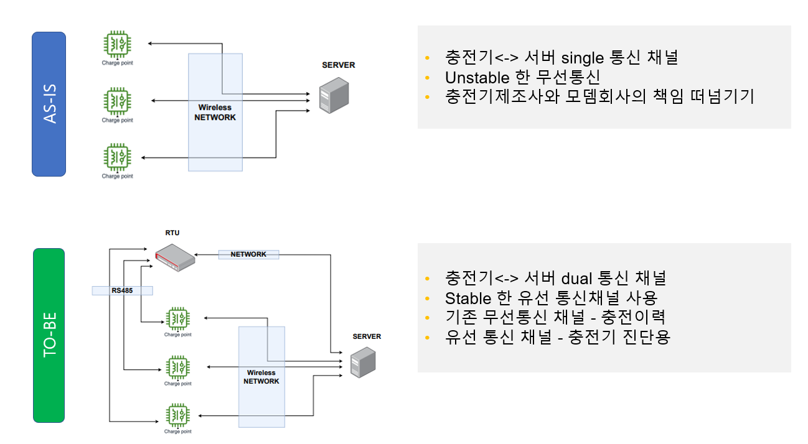

### AS-IS Configuration:
- Setup: Each EV charger communicates directly with the server using a single wireless network channel.   
- Issues:    
  - Unstable Communication: The reliance on a single wireless communication channel is prone to instability.
  - Responsibility Shifting: There may be issues between the EV charger manufacturers and modem companies regarding responsibility for failures.

### TO-BE Configuration:
- Setup: EV chargers are clustered using RS-485 communication and are connected to the server via both wireless and wired channels (dual communication channels).   
- Improvements:    
  - Stable Communication: The introduction of a stable wired communication channel (RS-485) significantly improves reliability.   
  - Redundancy: The dual-channel setup ensures redundancy, with wireless communication serving as a backup and wired communication as the primary.   
  - Better Diagnosis: Wired communication allows for more effective diagnostic processes for the EV chargers.   

